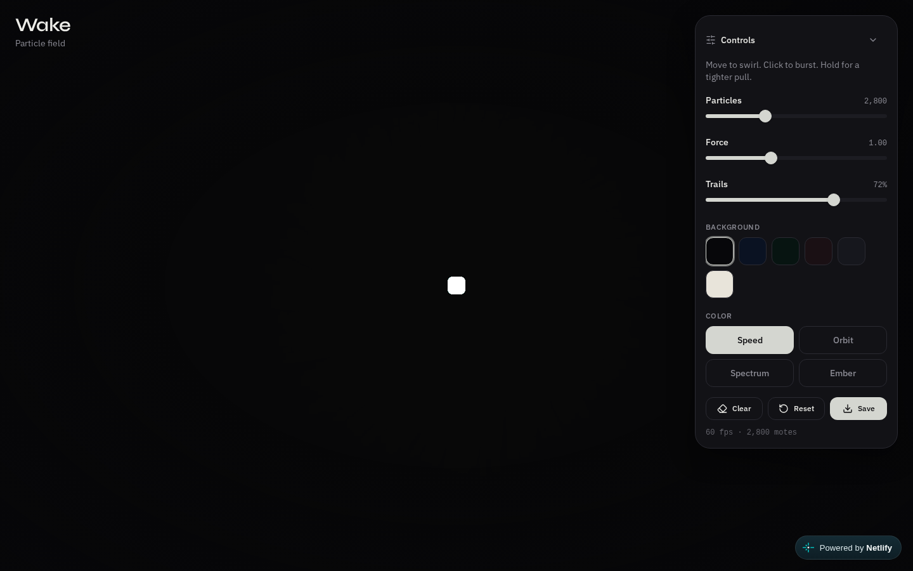

# Wake

An interactive particle field. Move the pointer to swirl the motes; click to burst them outward. Trails, color shifts, and a live force field do the rest.

**Live:** [wake-field.netlify.app](https://wake-field.netlify.app)



```
Pointer
  ↓
Force field (attract / shockwave)
  ↓
Particle integration
  ↓
Trails + color (speed / orbit / spectrum)
```

## Controls

- **Move** — particles orbit toward the cursor
- **Click** — shockwave burst
- **Hold** — tighter, stronger pull
- **Particles / Force / Trails** — density, attraction, and wake length
- **Background** — Void, Ink, Abyss, Dusk, Slate, Paper
- **Color** — Speed, Orbit, Spectrum, Ember
- **Clear** — wipe trails
- **Reset** — restore defaults and reseed the field
- **Save** — download a PNG of the canvas

## Stack

TanStack Start, React, Tailwind, Canvas 2D. All simulation is on-device.

## Related

- [aether-visualizer](https://github.com/ahmaddroobi99/aether-visualizer) — audio-driven canvas
- [lattice](https://github.com/ahmaddroobi99/lattice)

---

Account grouping: research first, undergraduate last — see the [profile README](https://github.com/ahmaddroobi99/ahmaddroobi99). GitHub cannot custom-sort the Repositories tab.

